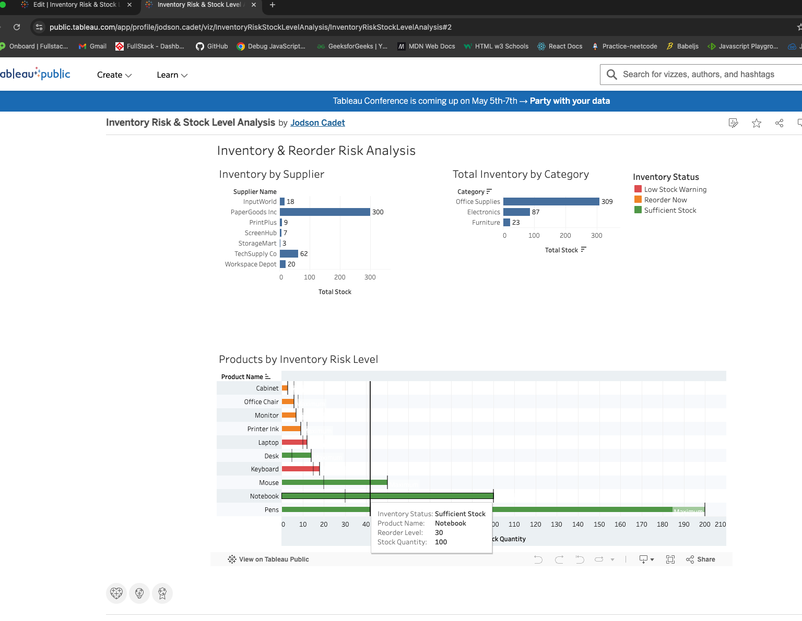

# 🏬 Inventory & Reorder Risk Analysis

## 🚀 Project Overview

In this project, I analyzed inventory data to identify low-stock products, reorder risks, category-level stock distribution, and supplier inventory exposure. The goal was to help the business make smarter inventory decisions and prevent stock shortages or overstock issues.

---

## 🛠️ Tools Used

- PostgreSQL
- SQL (WHERE, GROUP BY, SUM, ORDER BY, CASE WHEN)
- Visual Studio Code
- Tableau Public
- GitHub

---

## 📁 Dataset

The dataset includes:

- product_id
- product_name
- category
- stock_quantity
- reorder_level
- supplier_name

---

## ❓ Business Questions

- Which products are below reorder level?
- Which categories hold the most total stock?
- Which suppliers support the most inventory?
- Which products are at the highest reorder risk?
- How can products be classified by inventory status?

## ✅ Answers

- Several products fall below their reorder level and require immediate replenishment.
- Inventory is unevenly distributed across categories, with some categories carrying much more stock than others.
- Supplier exposure varies, showing which vendors support the largest share of inventory.
- CASE WHEN can be used to classify products into reorder and risk categories.
- Stock gap analysis helps identify both low-stock and overstocked products.

---

## 💡 Key Insights

- Products below reorder level represent immediate operational risk and should be prioritized for replenishment.
- Inventory classification makes it easier to identify which items need urgent action versus monitoring.
- Category-level stock analysis can support inventory balancing and budget decisions.
- Supplier-level stock analysis helps reveal vendor dependence and concentration risk.
- Overstocked items may represent tied-up capital and inefficient inventory planning.

---

## 🐘 SQL Queries Used

### Products Below Reorder Level

```sql
SELECT
    product_name,
    stock_quantity,
    reorder_level
FROM inventory
WHERE stock_quantity < reorder_level;
```

---

## 📊 Tableau Dashboard

Built an interactive Tableau dashboard to visualize inventory risk levels,
stock quantities vs reorder thresholds, and supplier/category breakdowns.

**Key visualizations:**

- Inventory by Supplier (bar chart)
- Total Inventory by Category (bar chart)
- Products by Inventory Risk Level (color-coded bars with reorder threshold lines)

🔗 [View Live Dashboard](https://public.tableau.com/views/InventoryRiskStockLevelAnalysis/InventoryRiskStockLevelAnalysis?:language=en-US&:sid=&:redirect=auth&:display_count=n&:origin=viz_share_link)


