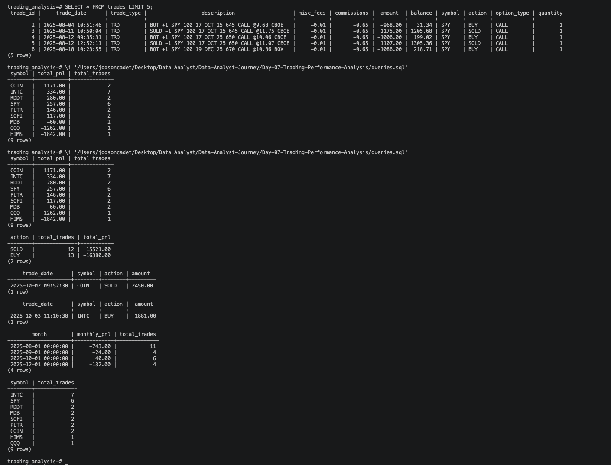

# Trading Performance Analysis — Options Trading Dashboard

## Project Overview
I pulled my real options trade history from ThinkorSwim and analyzed it 
to understand where I was making money, where I was losing, and which 
symbols I traded the most. The goal was to treat my own trading like a 
business and find patterns in the data.

---

## Tools Used
- PostgreSQL
- SQL (SUM, COUNT, GROUP BY, ORDER BY, DATE_TRUNC)
- Excel (data cleaning)
- Tableau Public (dashboard)
- Visual Studio Code
- GitHub

---

## Dataset
Real options trade history exported from ThinkorSwim — 25 trades from 
August 2025 to December 2025.

Columns:
- trade_date
- symbol
- action (BUY/SELL)
- option_type (CALL/PUT)
- quantity
- amount (profit/loss per trade)
- balance
- commissions

---

## Business Questions
- Which symbol generated the most profit or loss?
- Which months were most profitable?
- Which symbol did I trade the most?
- What was my best and worst single trade?
- How did my account balance trend over time?

## Answers
- COIN was the most profitable single trade at $2,450
- October and November had the highest trading activity
- INTC was the most traded symbol with 6 trades
- Worst trade was a -$1,881 loss on INTC
- Account balance trended from $31 up to $3,255 before pulling back

---

## Key Insights
- Heavy concentration in INTC created outsized risk
- COIN trade had the best risk/reward of the entire period
- Smaller position sizes on SPY produced more consistent results
- Monthly P&L was volatile — no consistent winning month

---

## SQL Queries Used

### Total P&L by Symbol
```sql
SELECT 
    symbol,
    SUM(amount) AS total_pnl,
    COUNT(*) AS total_trades
FROM trades
GROUP BY symbol
ORDER BY total_pnl DESC;
```

### Monthly P&L Trend
```sql
SELECT
    DATE_TRUNC('month', trade_date) AS month,
    SUM(amount) AS monthly_pnl,
    COUNT(*) AS total_trades
FROM trades
GROUP BY month
ORDER BY month ASC;
```

---

## Dashboard
🔗 Tableau Public link coming soon

