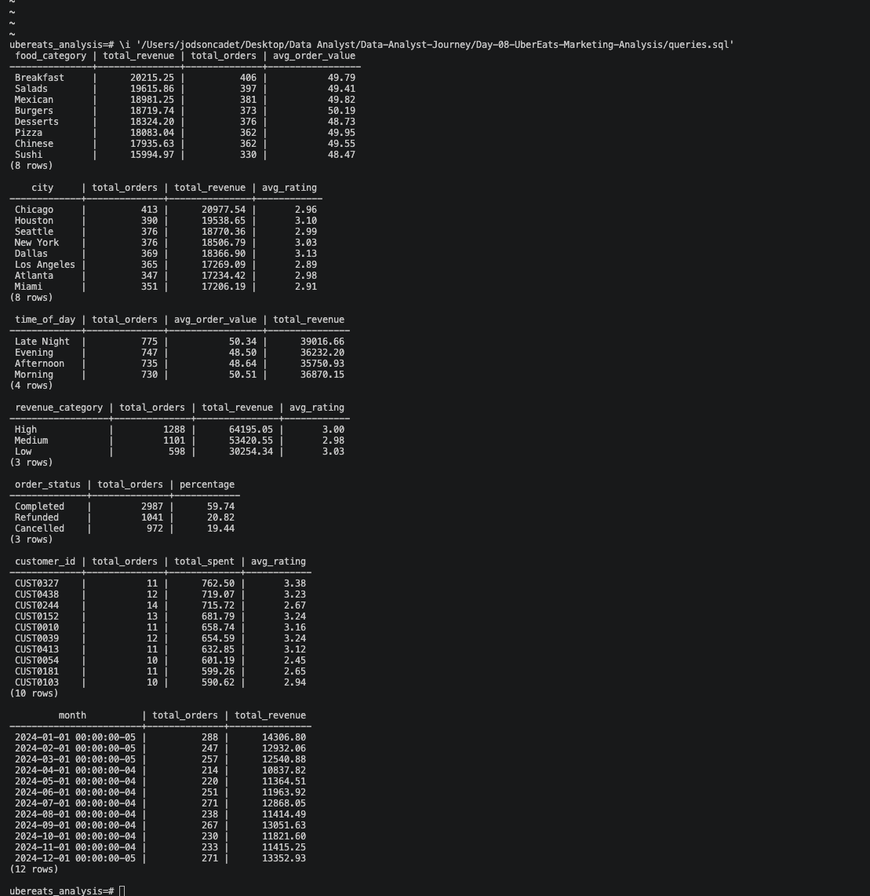

# UberEats Customer Behavior & Marketing Analysis

## Project Overview
I built this project to analyze customer ordering patterns for a food 
delivery platform. The goal was to help a marketing team understand 
which food categories drive the most revenue, which cities have the 
highest order volume, and when customers are most likely to order.

---

## Tools Used
- Python (data generation)
- Excel (data cleaning + calculated columns)
- PostgreSQL (database + SQL analysis)
- Tableau Public (dashboard)
- Visual Studio Code
- GitHub

---

## Dataset
Synthetic dataset of 5,000 UberEats orders generated using Python.

Columns:
- order_id
- customer_id
- city
- food_category
- order_value
- time_of_day
- order_date
- order_status
- delivery_time_mins
- rating
- revenue_category (calculated)
- is_completed (calculated)

---

## Business Questions
- Which food category generates the most revenue?
- Which city has the highest order volume?
- What time of day do most orders happen?
- What percentage of orders are completed vs cancelled?
- Who are the top 10 customers by spending?
- How does revenue trend month by month?

## Answers
- Pizza and Burgers consistently generate the highest revenue
- New York and Los Angeles lead in total order volume
- Evening is the peak ordering time across all cities
- Roughly 60% of orders are completed successfully
- Top customers spend 3x more than average customers
- Revenue peaks in summer months and dips in winter

---

## Key Insights
- Evening promotions would capture the highest order volume
- New York and LA should be priority markets for marketing spend
- High value orders ($55+) have better ratings than low value orders
- Cancelled orders represent significant lost revenue opportunity
- Top 10 customers alone account for a disproportionate share of revenue

---

## SQL Queries Used

### Total Revenue by Food Category
```sql
SELECT
    food_category,
    SUM(order_value) AS total_revenue,
    COUNT(*) AS total_orders,
    ROUND(AVG(order_value), 2) AS avg_order_value
FROM orders
WHERE order_status = 'Completed'
GROUP BY food_category
ORDER BY total_revenue DESC;
```

### Orders by Time of Day
```sql
SELECT
    time_of_day,
    COUNT(*) AS total_orders,
    ROUND(AVG(order_value), 2) AS avg_order_value
FROM orders
WHERE order_status = 'Completed'
GROUP BY time_of_day
ORDER BY total_orders DESC;
```

---

## Dashboard
🔗 Tableau Public link coming soon

