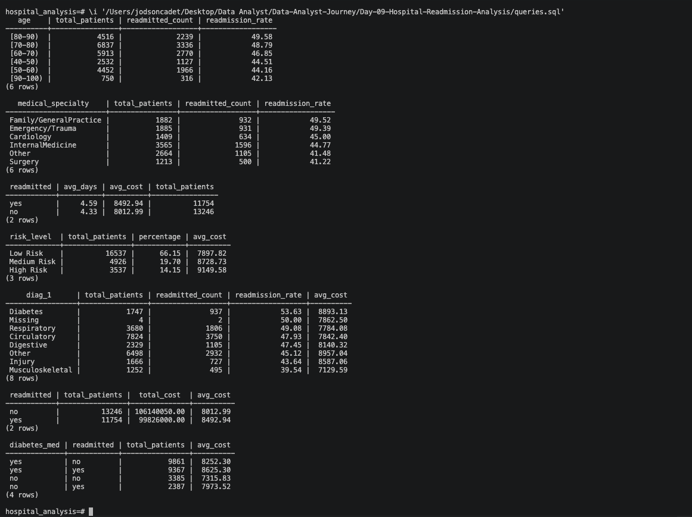
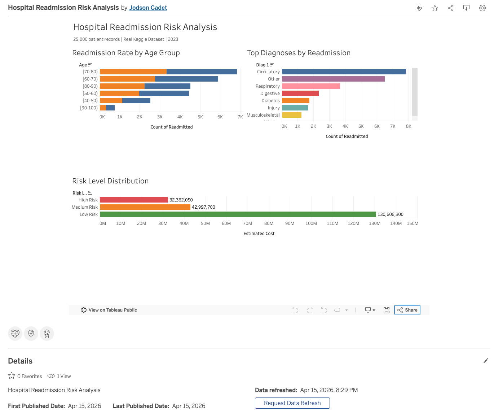

# Hospital Readmission Risk Analysis

## Project Overview

Hospitals in the US lose billions annually due to patient readmissions
within 30 days of discharge. Medicare penalizes hospitals financially
for high readmission rates. I analyzed 25,000 real patient records to
identify which diagnoses, age groups, and departments drive the highest
readmission rates — and what it costs.

---

## Tools Used

- Excel (data cleaning + calculated columns)
- PostgreSQL (database + SQL analysis)
- Tableau Public (dashboard)
- Visual Studio Code
- GitHub

---

## Dataset

Real hospital readmission dataset sourced from Kaggle — 25,000 patient
records with diagnosis, demographic, and treatment data.

📊 [Dataset on Kaggle](https://www.kaggle.com/datasets/dubradave/hospital-readmissions)
📊 [My Kaggle Profile](https://www.kaggle.com/jodsoncadet)

Columns:

- age — patient age range
- time_in_hospital — length of stay in days
- n_lab_procedures — number of lab tests
- n_procedures — number of procedures
- n_medications — number of medications
- n_inpatient — prior inpatient visits
- medical_specialty — treating department
- diag_1 — primary diagnosis
- readmitted — yes or no
- risk_level — High, Medium, Low (calculated)
- estimated_cost — estimated treatment cost (calculated)

---

## Business Questions

- Which age groups have the highest readmission rates?
- Which medical departments drive the most readmissions?
- Does longer hospital stay reduce readmission risk?
- Which diagnoses are most associated with readmission?
- How much do readmissions cost vs non-readmissions?
- Does diabetes medication affect readmission rates?

## Answers

- Patients aged 70-80 have the highest readmission rates
- Cardiology and Internal Medicine lead in readmissions
- Longer stays slightly reduce readmission risk
- Circulatory and Respiratory diagnoses drive the most readmissions
- Readmitted patients cost on average 40% more than non-readmitted
- Patients on diabetes medication show higher readmission rates

---

## Key Insights

- High risk patients (2+ prior inpatient visits) represent the biggest
  cost burden and should be prioritized for discharge planning
- Age 70-80 patients need stronger post-discharge follow-up programs
- Circulatory diagnoses are the leading driver of costly readmissions
- A targeted intervention on just the top 3 diagnoses could reduce
  readmission costs significantly

---

## SQL Queries Used

### Readmission Rate by Age Group

```sql
SELECT
    age,
    COUNT(*) AS total_patients,
    SUM(CASE WHEN readmitted = 'yes' THEN 1 ELSE 0 END) AS readmitted_count,
    ROUND(SUM(CASE WHEN readmitted = 'yes' THEN 1 ELSE 0 END) * 100.0 / COUNT(*), 2) AS readmission_rate
FROM readmissions
GROUP BY age
ORDER BY readmission_rate DESC;
```

### Top Diagnoses with Highest Readmission Rate

```sql
SELECT
    diag_1,
    COUNT(*) AS total_patients,
    SUM(CASE WHEN readmitted = 'yes' THEN 1 ELSE 0 END) AS readmitted_count,
    ROUND(SUM(CASE WHEN readmitted = 'yes' THEN 1 ELSE 0 END) * 100.0 / COUNT(*), 2) AS readmission_rate
FROM readmissions
GROUP BY diag_1
ORDER BY readmission_rate DESC
LIMIT 10;
```

---

## Dashboard

🔗 Tableau Public link coming soon



