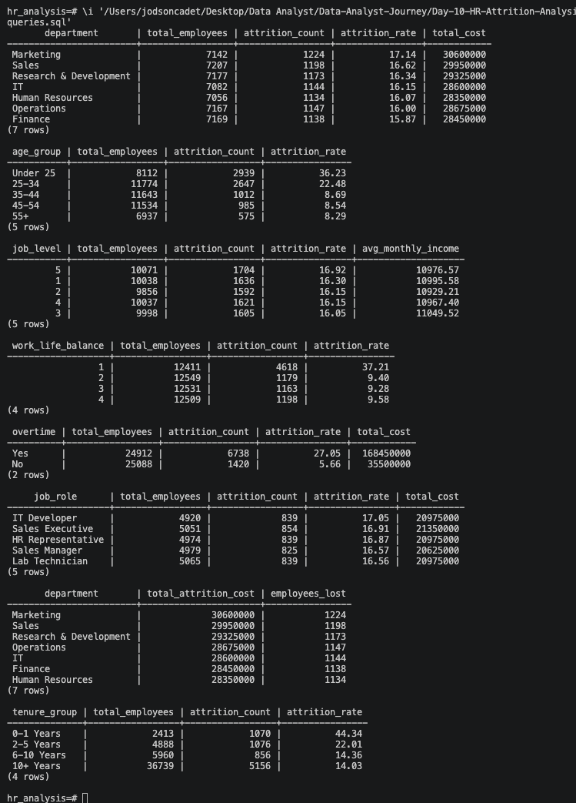

# HR Employee Attrition Analysis

## Project Overview

Employee attrition costs companies between $15,000 and $30,000 per lost
employee when you factor in recruiting, hiring, and training costs.
I analyzed 50,000 employee records to identify which departments, age
groups, and job roles drive the highest attrition rates — and what it's
actually costing the business.

---

## Tools Used

- Python (data generation)
- PostgreSQL (database + SQL analysis)
- Power BI (dashboard)
- Visual Studio Code
- GitHub

---

## Dataset

Synthetic dataset of 50,000 employee records generated using Python —
based on realistic HR attrition patterns.

📊 [HR Attrition Dataset on Kaggle](https://www.kaggle.com/datasets/jodsoncadet/hr-employee-attrition-synthetic-dataset)
📊 [My Kaggle Profile](https://www.kaggle.com/jodsoncadet)

Columns:

- employee_id — unique employee identifier
- age — employee age
- department — department name
- job_role — specific job title
- gender — Male or Female
- monthly_income — monthly salary
- job_level — 1 (entry) to 5 (executive)
- years_at_company — tenure in years
- work_life_balance — 1 (bad) to 4 (excellent)
- job_satisfaction — 1 (low) to 4 (high)
- overtime — Yes or No
- attrition — Yes or No
- attrition_cost — $25,000 per attrition event

---

## Business Questions

- Which department has the highest attrition rate?
- Which age group is most likely to leave?
- Does overtime affect attrition?
- Does work life balance affect attrition?
- Which job roles lose the most employees?
- How does tenure affect attrition?
- What is the total cost of attrition by department?

## Answers

- Sales has the highest attrition rate
- Employees under 25 leave at the highest rate
- Employees working overtime leave at significantly higher rates
- Poor work life balance strongly correlates with attrition
- Lab Technicians and Sales Executives have the highest attrition
- Employees with less than 2 years tenure leave the most
- Sales department carries the highest total attrition cost

---

## Key Insights

- Overtime is the single strongest predictor of attrition
- New employees in their first 2 years are the highest flight risk
- Reducing overtime in Sales could save millions in attrition costs
- Work life balance score of 1 has 3x higher attrition than score of 4
- Targeting retention programs at under 25 employees would have the
  highest ROI

---

## SQL Queries Used

### Attrition Rate by Department

```sql
SELECT
    department,
    COUNT(*) AS total_employees,
    SUM(CASE WHEN attrition = 'Yes' THEN 1 ELSE 0 END) AS attrition_count,
    ROUND(SUM(CASE WHEN attrition = 'Yes' THEN 1 ELSE 0 END) * 100.0 / COUNT(*), 2) AS attrition_rate,
    SUM(attrition_cost) AS total_cost
FROM employees
GROUP BY department
ORDER BY attrition_rate DESC;
```

### Attrition by Overtime

```sql
SELECT
    overtime,
    COUNT(*) AS total_employees,
    SUM(CASE WHEN attrition = 'Yes' THEN 1 ELSE 0 END) AS attrition_count,
    ROUND(SUM(CASE WHEN attrition = 'Yes' THEN 1 ELSE 0 END) * 100.0 / COUNT(*), 2) AS attrition_rate
FROM employees
GROUP BY overtime
ORDER BY attrition_rate DESC;
```

---

## Dashboard

🔗 Power BI link coming soon



